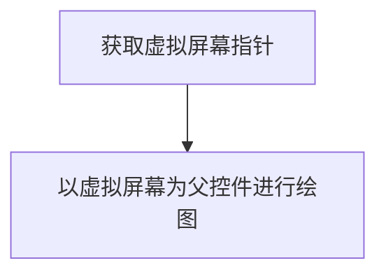

# ApplicationManager 组件文档
`ApplicationManager` 主要拥有以下功能：
1. 应用注册、安装、卸载、运行、停止。
2. 应用权限管理与封装。

## 应用开发
应用开发的所有函数均以`GhostNativeApp`前缀开头。  

### NativeApp开发守则
由于目前暂无法做到对单片机内置App的二进制鉴权且当前所有NativeApp均需要编译至固件中，因此无法做到强制性开发规则，因此特制定如下守则。
不符合守则的代码将拒绝被合并进Master。

### 常见需求
#### AppInfo声明
本步骤为调用所有GhostApi的第一步。  
所需权限：  
无。  

标准流程：  
0. 引用``头文件。
1. 在所有所需要调用GhostApi的**源文件**全局变量区声明`DeclareNativeAppInfo();`
2. 在入口函数的第一行执行`GhostAppNativeInfoInit(MacroGhostLauncherPackageName);`

#### 获取虚拟屏幕对象  
App想要在屏幕上显示图像时，必须先获取虚拟屏幕指针。  
所需权限：  
无。   

标准流程：  
0. 完成AppInfo声明。
1. 使用`GhostNativeAppGetVirtualScreen`获取虚拟屏幕。
2. 以本虚拟屏幕为父组件进行绘制。  



注意：每个App只能获取一个屏幕。

#### 打开文件
所需权限：
若打开本App所属文件夹下文件则不需要任何权限。
若打开`SdCard`文件夹下文件则需要``。  
若打开其他App所属文件则需要``。  
若打开`System`文件夹下文件则需要`Root`权限。

标准流程：
0. 完成AppInfo声明。
1. 调用`GhostNativeAppOpenFile`打开文件。
2. 

## Ghost系统组件开发
系统组件开发的所有函数均以`GhostAppMgr`前缀开头。  
### 常见需求
#### GhostAppInfo_t内存管理
GhostAppInfo_t有两种内存管理方式：
1. 可以使用`key` `value`操作值的手动管理方案。
2. 通过相关函数操作的自动管理方案。


#### 注册应用
所需权限：
App内禁止调用，仅允许系统调用。  

标准流程：  
1. 将应用的包名，入口函数，终止函数等参数声明至`GhostAppInfo_t`。
2. 调用`GhostAppMgrRegister`注册程序。

注意：
你需要确保函数调用时的`AppInfo_t`的生命周期。  


#### 通过包名查询应用信息
所需权限：


标准流程：  
1. 调用`GhostAppMgrAppInfoInit`初始化`GhostAppInfo_t`变量(禁止使用其他方法初始化)。
2. 调用`GhostAppMgrGetInfoByPackageName`获取参数。


#### 前台启动应用
所需权限：


## Api手册
### GhostAppMgrInit
```C
/// <summary>
/// Init Ghost application manager.
/// </summary>
/// <param name="void"></param>
/// <returns>Function execution result.</returns>
GhostError_t GhostAppMgrInit(void);
```  
本函数会执行`GhostApplicationManager`组件初始化。  

### GhostAppInfo_t
```C
/// <summary>
/// Typedef of Ghost application info.
///		There are two memory management methods in this structure:
///		1. Construction method using key value:
///			In this case, you need to ensure the life cycle of the variable key value.
///			Appropriate instance:
///			```C
///				GhostAppInfo_t info;
///				info.ApplicationType = GhostNativeApplication;
///				info.PackageName = "tech.h13.ghost";
///				info... //Other application info..
///				GhostAppMgrRegister(&info);
///				// GhostAppMgrAppInfoDestory(&info); //Don't do this, it will trigger exceptions.
///			```
///			Error instance:
///			```C
///				GhostAppInfo_t info;
///				info.ApplicationType = GhostNativeApplication;
///				{
///					info.PackageName = "tech.h13.ghost";
///				}
///				info... //Other application info..
///				GhostAppMgrRegister(&info); //At this point, the `info.PackageName` has become a dangling pointer. Behavior undefined.
///			```
///			
///		2. Use init destroy function to construct and destruct:
///			In this case, do not change the value of key manually.
///			Appropriate instance:
///			```C
///				GhostAppInfo_t info = GhostAppMgrAppInfoInit(); //Set all key values to 0.
///				GhostAppMgrGetInfoByPackageName("tech.h13.ghost", &info);
///				GhostAppMgrAppInfoDestory(&info); //This function must be called, otherwise memory leakage will occur.
///			```
///			Legal but not recommended instance:
///			```C
///				GhostAppInfo_t info = GhostAppMgrAppInfoInit(); //Set all key values to 0.
///				GhostAppMgrGetInfoByPackageName("tech.h13.ghost", &info); 
///				GhostMemMgrFree(info.PackageName);
///				info.PackageName = GhostMemMgrCalloc(1, strlen("tech.h13.ghost") + 1);
///				memcpy(info.PackageName, "tech.h13.ghost", strlen("tech.h13.ghost") + 1);
///				GhostAppMgrAppInfoDestory(&info); //It's okay, but it's not recommended.
///			```
///			Error instance:
///			```C
///				GhostAppInfo_t info = GhostAppMgrAppInfoInit(); //Set all key values to 0.
///				info.PackageName = "tech.h13.ghost"; //In this mode, do not change the key value manually, otherwise it will trigger exceptions.
///				GhostAppMgrGetInfoByPackageName("tech.h13.ghost", &info); 
///				GhostAppMgrAppInfoDestory(&info);
///			```
///			Do not use standard memory Libraries!
///			```C
///				GhostAppInfo_t info = GhostAppMgrAppInfoInit(); //Set all key values to 0.
///				GhostAppMgrGetInfoByPackageName("tech.h13.ghost", &info); 
///				GhostMemMgrFree(info.PackageName);
///				info.PackageName = calloc(1, strlen("tech.h13.ghost") + 1);
///				memcpy(info.PackageName, "tech.h13.ghost", strlen("tech.h13.ghost") + 1);
///				GhostAppMgrAppInfoDestory(&info); //It's okay, but it's not recommended.
///			```
/// </summary>
typedef struct
{
	GhostApplicationType_t ApplicationType;
	char* PackageName;
	char* ApplicationName;
	int Version;
	GhostError_t(*ApplicationEntryFunction)(int Argc, void** Args);
	GhostError_t(*ApplicationDestructorFunction)(char** TranceBackMsg);
} GhostAppInfo_t;
```


