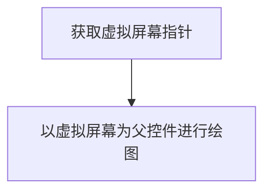

# ApplicationManager 组件文档
`ApplicationManager` 主要拥有以下功能：
1. 应用注册、安装、卸载、运行、停止。
2. 应用权限管理与封装。

## ApplicationManager组件初始化

## 应用注册

## 权限管理
### App获取虚拟屏幕对象
App想要在屏幕上显示图像时，必须先获取虚拟屏幕指针。  
App:  


```C
/// <summary>
/// Get virtual screen by the pointer of application info.
/// </summary>
/// <param name="AppInfoPtr">Pointor of application info.</param>
/// <param name="ScreenPtr">Pointor of virtual screen.(pointor to lv_obj_t*)</param>
/// <returns>Function execution result.</returns>
/// TODO: Release page automatically when releasing the running program.
GhostError_t GhostAppGetVirtualScreen(const GhostAppInfo_t* const AppInfoPtr, lv_obj_t** const PagePtr);
```
注意：每个App只能获取一个屏幕。
