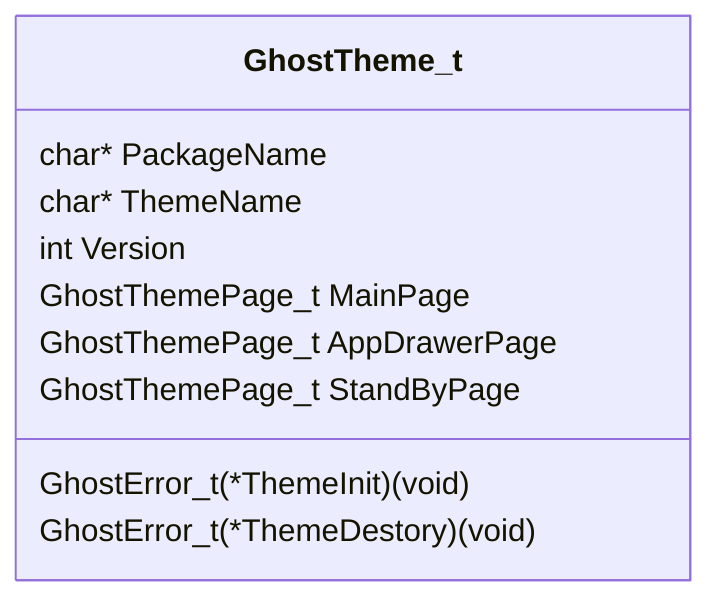
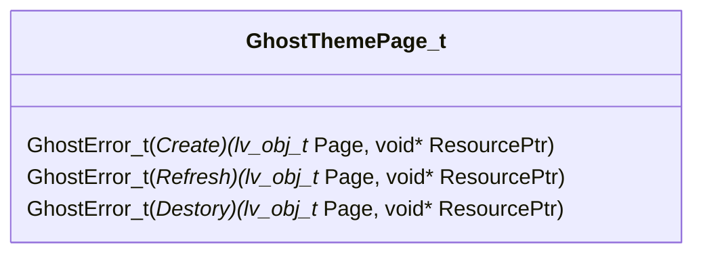

# Ghost主题管理器
本文档为Ghost主题管理器开发文档，[主题开发文档](../../../../Docs/Developer/Theme/ReadmeCN.md)请自行点击跳转。

## Ghost主题管理器框架  
Ghost主题主要负责Ghost launcher的各个页面的渲染，laucher拆分为以下几个页面：  
1. `MainPage` (主页面)
2. `StandbyPage` (息屏显示页面)
3. `AppDrawerPage` (应用抽屉页面)

<!--TODO: 为每个页面附图-->

而主题负责提供上述页面的渲染函数以供laucher调用渲染。  
用户在设置中选定每个页面的主题后，

## Ghost主题管理器内部实现
### 主题类型

### 页面类型

