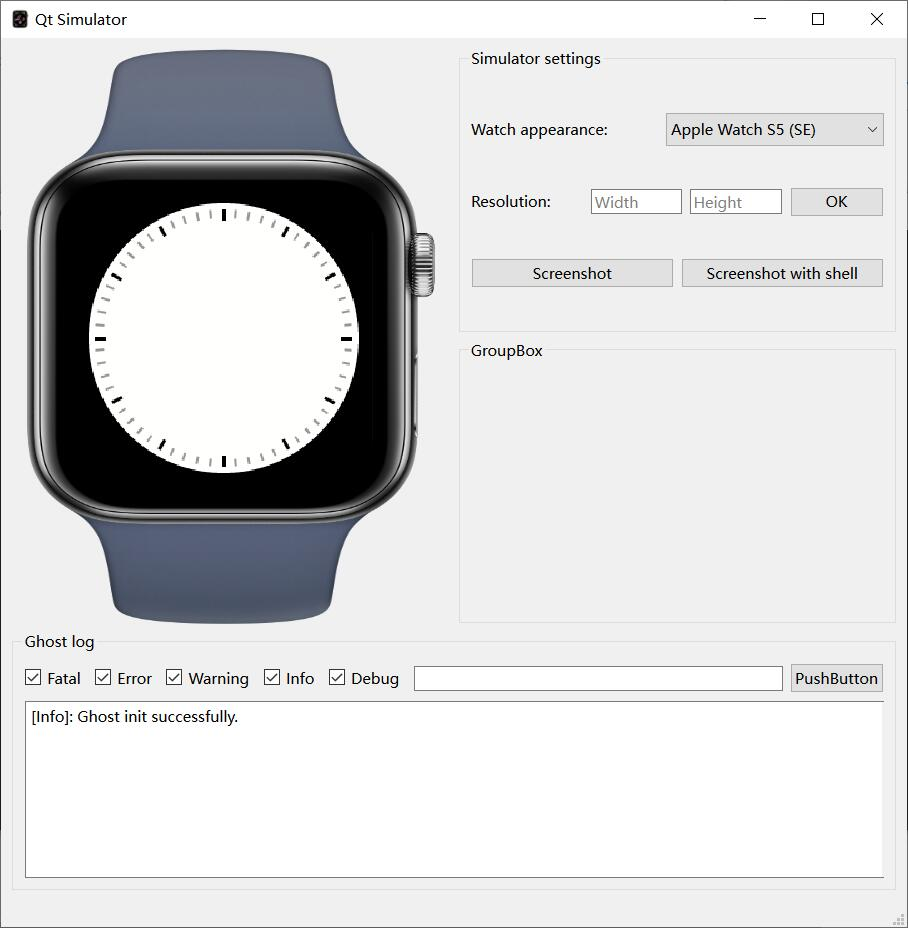

# Ghost Qt simulator
This project will later become a debugger for third-party apps.  

## Command line parameters
Usage: `./QtSimulator ${VarName} ${VarValue} [${VarName2} ${VarValue2} ..]`
Frequently-used Qt environment variables:  
| VarName                     | Effect                                               |
| --------------------------- | ---------------------------------------------------- |
| `QT_ENABLE_HIGHDPI_SCALING` | Enable system DPI scaling, scaling is disabled if 0. |
| `QT_SCALE_FACTOR`           | Set window zoom factor.                              |

All qenv are supported here.  

## FAQ
1. If there is jagged effect when displaying.
Such as this:  
  
Change the Windows settings as shown below.  
  

2. Fatal: Ghost file system init error, please check if the file system exists.  
Enter the directory of `WindowsSimulator.exe`, and open Powershell(not cmd).  
```Powershell  
New-Item -ItemType SymbolicLink -Path .\Ghost -Target ..\..\..\Mount\
```  

3. When designing the pixel level UI, the actual size of the lvgl control does not match the display size.  
Use `QT_ENABLE_HIGHDPI_SCALING` feature.  
```Powershell  
./QtSimulator.exe QT_ENABLE_HIGHDPI_SCALING 0
```  


## Develop UI


## Develop Qt simulator  
### Change UI
Use `Qt Creator` open [./Qt/CMakeLists.txt](./Qt/CMakeLists.txt).  
