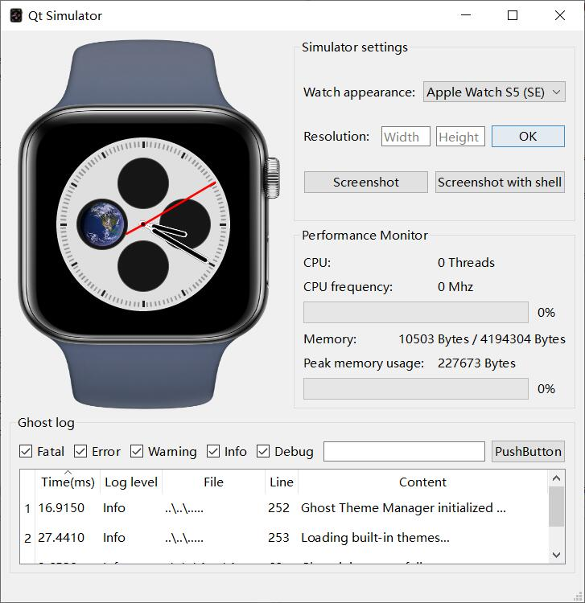

# Ghost
<div align = "center">
  
  <h1 align = "center">An amazing watch.</h1>
</div>

<p align="center">
  <a href="https://github.com/h13-0/Ghost/releases"></a>
  <a href="https://github.com/h13-0/Ghost/blob/master/LICENSE"></a>
</p>  

<p align="center">
  <a href="https://github.com/h13-0/Ghost/blob/master/ReadmeCN.md" target="opentype">[中文文档]</a>
</p>  

<!-- 人来来去去，离开了一个又一个，这个表还只是个Demo. -->  

# Functions and tasks
- [x] Basic software framework.
  - [X] Support lvgl.
  - [x] Support lvgl touchpad.
  - [X] Ghost package manager.
  - [X] Ghost clock.
  - [X] Ghost thread.
  - [X] Ghost file system.
  - [X] Ghost safe lvgl.
  - [X] Ghost log.
  - [x] Ghost launcher.
  - [x] Ghost theme manager.
  - [ ] Ghost Power manager.
  - [ ] lua interpreter.
- [x] Basic function realization.
  - [X] Basic clock function.
  - [ ] Built in applications.
    - [ ] Calculator.
    - [ ] Health.
  - [ ] Built in games.
    - [ ] Flappy bird.
- [ ] Ghost installable application support.
  - [ ] Authority manager.
- [ ] PCB and BOM.
  - [ ] Migrate to esp-idf.
- [ ] Mechanical structure.

# Available platforms
This project is recommended to be used in MCU or SOC of 32-bit or above.  
- [x] Windows/Linux Qt simulator.
- [ ] esp32s3.
- [ ] Linux frame buffer.

## Windows/Linux Simulator  
[Development documentation](./Ghost/Platforms/QtSimulator/Readme.md)  
  
### Build
```Powershell
git clone --recursive https://github.com/h13-0/Ghost.git
```
Open in visual studio in folder [Ghost](./Ghost/) and build.  
**Note that QT needs to be deployed before running.**  
**Enter the directory of `WindowsSimulator.exe`, and open Powershell(not cmd).**  

<details>  
<summary>Deactivate <b>FUCKING</b> anaconda.</summary><br>  

```Powershell  
conda deactivate
```  
</details><br>  

Deploy Qt environment.  
```Powershell  
windeployqt WindowsSimulator.exe
```    
Mount file system.  
```Powershell  
New-Item -ItemType SymbolicLink -Path .\Ghost -Target ..\..\..\Mount\
```  
Now you can run the Qt Simulator.

### [FAQ](https://github.com/h13-0/Ghost/tree/master/Ghost/Platforms/QtSimulator#FAQ)  

## esp32s3
Will launch soon(perhaps).  
